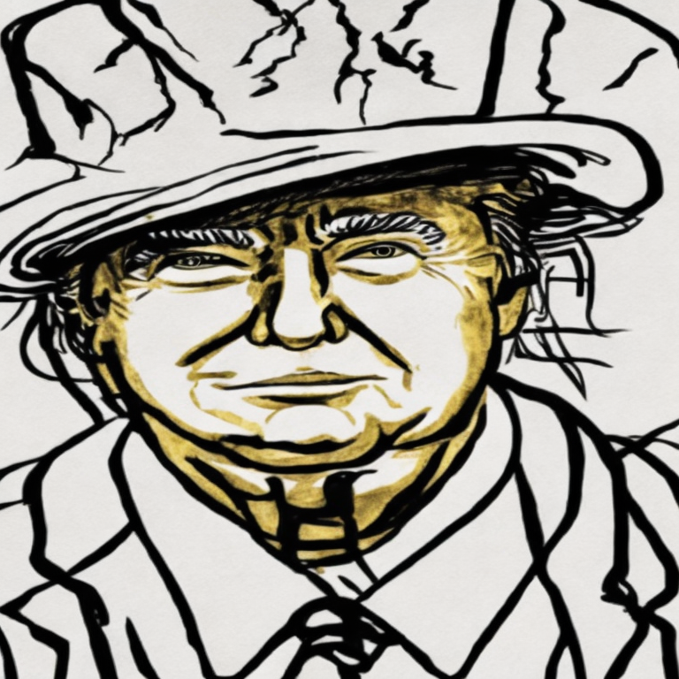

# Style-Image-Generation

***Fine-Tuning Stable Diffusion for Style-Specific Image Generation: The Nobel Laureate Aesthetic***

This work focuses on implementing fine-tuning techniques, specifically LoRA to adapt the Stable Diffusion model for style-specific tasks. The fine-tuning process aims to refine the model's capabilities to generate images that reflect the unique artistic characteristics of a specific style, in this case inspired by Nobel Laureate aesthetics ([EveryoneNobel](https://github.com/16131zzzzzzzz/EveryoneNobel/tree/main)), while retaining the model's general ability to generate diverse and coherent images.

The pretrained [Stable Diffusion v2.1](https://huggingface.co/stabilityai/stable-diffusion-2-1) was used as the starting point for fine-tuning. This model had already been trained on a large dataset for general text-to-image generation tasks, providing a strong baseline for style adaptation. The Nobel Laureate dataset sourced directly from the [Official Nobel Prize Website](https://www.nobelprize.org/prizes/lists/all-nobel-prizes/), served as the input for fine-tuning.

 

## Result

**Figure 1**: Generated Nobel Laureate style images on the fine-tuned model. Each image aligns with a descriptive caption, showcasing the model’s ability to adapt to specific styles while preserving the semantic details of the prompts.

 

**Figure 2**: Comparison of images generated using the same textual captions as input prompts. The first row shows images generated from the baseline model, while the second row displays images generated from our fine-tuned model, specifically adapted to produce Nobel Laureate-style illustrations. The captions provided in the third row serve as the shared input prompts for both models, highlighting the stylistic improvements achieved through fine-tuning.

 

**Table 1:** Quantitative comparison of models across various metrics. The baseline Stable Diffusion v2.1 and DALL-E 3 models demonstrate strong semantic diversity (CLIP and Inception Scores), while our fine-tuned models excel in stylistic and perceptual similarity to the Nobel Laureate style, as indicated by lower FID and LPIPS values. The results highlight a trade-off between style fidelity and semantic generalization, with LoRA ranks controlling fine-tuning efficiency and performance.

 

## Additional Images

| Caption                                                      |                            Rank 4                            |                            Rank 8                            |                           Rank 16                            |                           Rank 32                            |                           Rank 64                            | Rank 128                                                     |
| :----------------------------------------------------------- | :----------------------------------------------------------: | :----------------------------------------------------------: | :----------------------------------------------------------: | :----------------------------------------------------------: | :----------------------------------------------------------: | ------------------------------------------------------------ |
| Donald Trump with a serious face, and wearing a hat, in the style of Nobel Laureate. |  |  |  |  |  |  |
| Elon Musk with a bow tie, and a short hairstyle, in the style of Nobel Laureate. |  |  |  |  |  |  |
| Justin Bieber feeling shock, exuding warmth and approachability, in the style of Nobel Laureate. |  |  |  |  |  |  |
| Leo Messi with an angry expression, and wearing his jersey, in the style of Nobel Laureate. |  |  |  |  |  |  |
| A poised woman with flowing hair, a calm expression, and an air of elegance, in the style of Nobel Laureate. |  |  |  |  |  |  |
| Donald Trump with a warm smile, and wearing a scarf, in the style of Nobel Laureate. |  |  |  |  |  |  |
| A cheerful woman with curly hair, a warm smile, and a stylish scarf, in the style of Nobel Laureate. |  |  |  |  |  |  |
| A smiling man with a bald head, wearing a sweater and tie, exuding warmth and approachability, in the style of Nobel Laureate. |  |  |  |  |  |  |
| A wise man with glasses, slightly tousled hair, and a gentle smile, exuding warmth and intellect, in the style of Nobel Laureate. |  |  |  |  |  |  |

#### *References:*

[1] All Nobel Prizes — nobelprize.org. https://www.nobelprize.org/prizes/lists/all-nobel-prizes/. [Accessed 04-01-2025].

[2] GitHub - 16131zzzzzzzz/EveryoneNobel: A flexible framework powered by ComfyUI for generating per-
sonalized Nobel Prize images. — github.com. https://github.com/16131zzzzzzzz/EveryoneNobel. [Accessed 04-01-2025].

[3] Ian J. Goodfellow, Jean Pouget-Abadie, Mehdi Mirza, Bing Xu, David Warde-Farley, Sherjil Ozair, Aaron
Courville, and Yoshua Bengio. Generative adversarial networks, 2014.

[4] Edward J Hu, Yelong Shen, Phillip Wallis, Zeyuan Allen-Zhu, Yuanzhi Li, Shean Wang, Lu Wang, and
Weizhu Chen. LoRA: Low-rank adaptation of large language models. In International Conference on Learning Representations, 2022.

[5] Robin Rombach, Andreas Blattmann, Dominik Lorenz, Patrick Esser, and Björn Ommer. High-resolution
image synthesis with latent diffusion models. In Proceedings of the IEEE/CVF Conference on Computer
Vision and Pattern Recognition (CVPR), pages 10684–10695, June 2022.

[6] Patrick von Platen, Suraj Patil, Anton Lozhkov, Pedro Cuenca, Nathan Lambert, Kashif Rasul, Mishig
Davaadorj, Dhruv Nair, Sayak Paul, William Berman, Yiyi Xu, Steven Liu, and Thomas Wolf. Diffusers:
State-of-the-art diffusion models. https://github.com/huggingface/diffusers, 2022.
